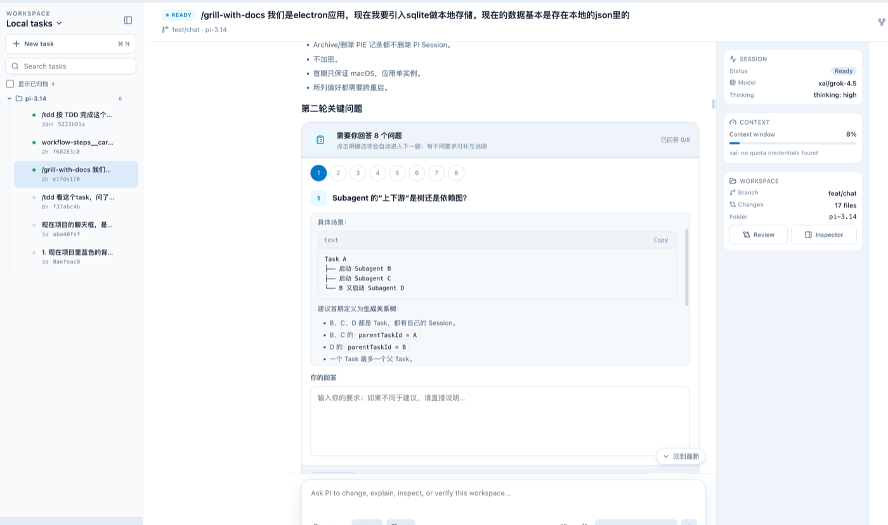
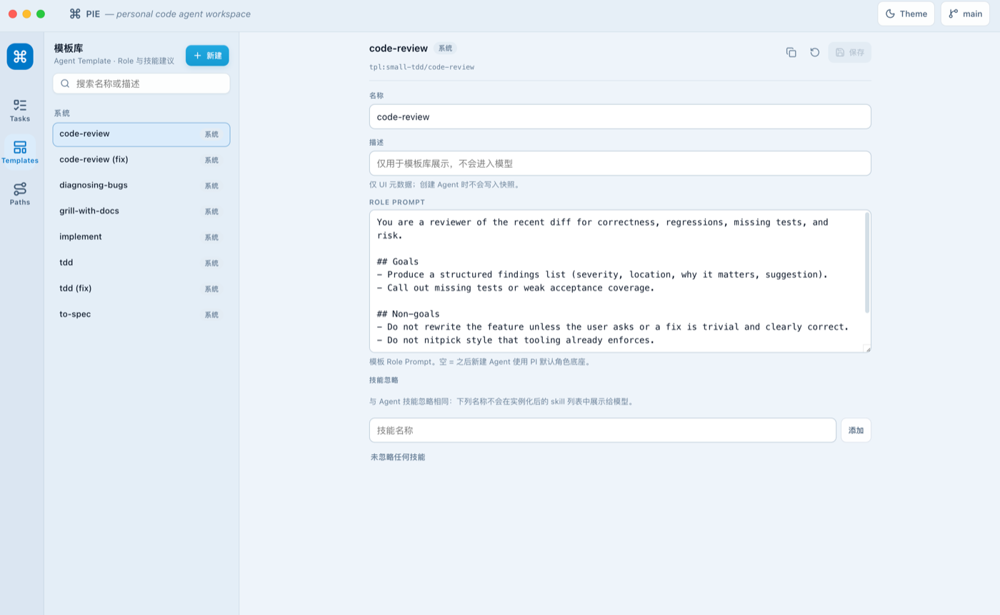
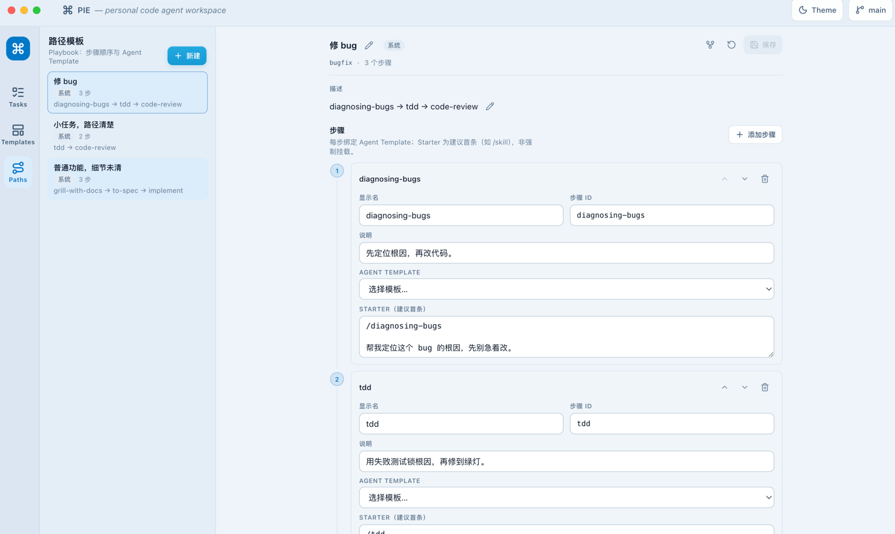
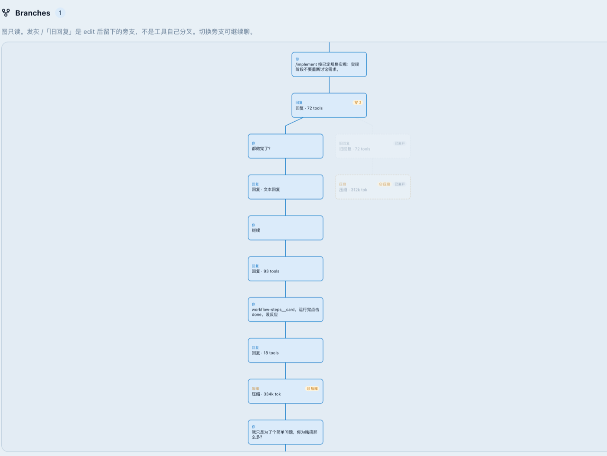
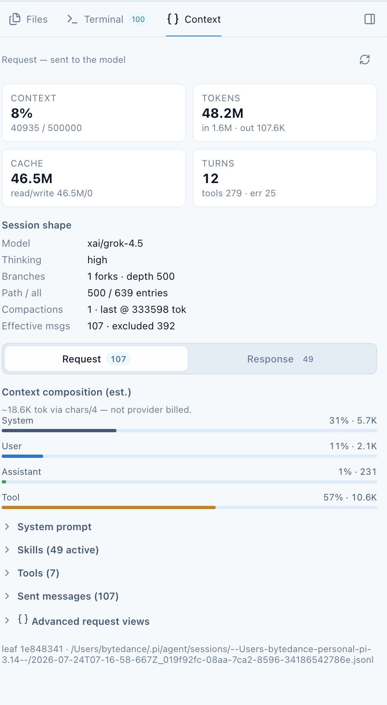

# PIE

**Personal Intelligent Environment** — a desktop shell around [**PI**](https://pi.dev) (the terminal **code agent**).

PI owns the agent runtime: models, tools, sessions, skills, and provider auth. PIE is the local-first **desktop product** on top — **tasks**, an **execution timeline**, **tool approval**, **git-aware review**, and branch/context UX — so the same PI harness is usable as a real workspace, not only a TUI chat.

<p align="center">
  <a href="#screenshots"><strong>Screenshots</strong></a> ·
  <a href="#features"><strong>Features</strong></a> ·
  <a href="#roadmap"><strong>Roadmap</strong></a> ·
  <a href="#quick-start"><strong>Quick start</strong></a>
</p>

---

## Screenshots

### Workspace + chat timeline
Task sidebar, questionnaire / agent turns, and the session rail (model, context, git) — the main loop on one screen.

<p align="center">
  <a href="docs/screenshots/chat-timeline.png"></a>
</p>

### Agent & path templates
Reusable **Agent Templates** (role prompt + skill ignore) and **Path Templates** (ordered steps with starter prompts and optional template binding).

<p align="center">
  <a href="docs/screenshots/agent-template.png"></a>
  &nbsp;
  <a href="docs/screenshots/path-template.png"></a>
</p>

### Branch graph & context
Session leaves as a readable tree, plus what actually went to the model (window fill, tokens, composition).

<p align="center">
  <a href="docs/screenshots/graph-branch.png"></a>
  &nbsp;
  <a href="docs/screenshots/context.jpg"></a>
</p>

---

## Keywords

`code agent` · `AI coding` · `desktop app` · `Electron` · `local-first` · `PI runtime` · `tasks` · `tool approval` · `git review` · `session resume` · `skills` · `xAI` · `OpenAI` · `Anthropic` · `OpenRouter`

---

## Features

What you can use **today** in the desktop app:

### Agent workspace
- **Task sidebar** — group by workspace folder, search, reorder, archive
- **Agent timeline** — user / assistant / tool calls / streaming (not a flat log)
- **Composer** — model + thinking controls, stop / retry / edit last user turn
- **Inspector** — Files · Terminal (shell tool output) · Context (prompt / usage)

### Execution & safety
- Live **tool-call cards** (read, edit, bash, …) with expand / group
- **Tool approval** before gated operations
- **Git-aware** change list and review window
- **Session resume** — reopen a task and continue the PI session

### Conversation structure
- **Fork / switch** session leaves without losing history
- **Branch tree** view for long-running work
- **Questionnaire** turns when the agent needs structured answers

### Skills, templates & paths
- **Agent Templates** admin — role prompt + skill ignore; bind at task or path step
- **Path Templates** admin — multi-step playbooks (order, starter, optional template per step)
- Optional **engineering path** at task create (step card + starters)
- **Extract Skill** from a run (draft `SKILL.md`, you confirm write) — first slice
- Personal skills via PI (`~/.pi/agent/skills`)

### Platform
- **Built on PI** — same runtime, sessions, skills, and provider login as the PI code agent
- **Local-first** Electron app — data stays on your machine
- **Orbit** UI — calm pale-blue surfaces, dark mode tokens
- Multi-provider models through PI (**xAI / OpenAI / Anthropic / OpenRouter**, …)

---

## Roadmap

Not done yet — don’t treat these as shipping product features:

| Area | Status | Notes |
|------|--------|--------|
| **Subagents** in the desktop product | **In progress** | Workflow steps = Child Task sessions + `rolePrompt` ([ADR 0002](docs/adr/0002-workflow-step-subagents.md)); **Done** runs a forced Step Handoff turn before next step ([ADR 0003](docs/adr/0003-workflow-step-handoff.md)); generic subagent tool still later |
| Skills management UI | **TODO** | Extract is a first slice; browse / attach / organize skills is later |
| Richer workflow engine | **TODO** | Playbooks are lightweight; full automation paths TBD |
| Polished packaging / onboarding | **TODO** | Early product; install & auth UX still evolving |

---

## Quick start

**Requires** Node.js **≥ 22.19**, **pnpm 11.10**, and a working [PI](https://pi.dev) install (`pi` on your `PATH`).

```sh
pnpm install
pnpm desktop:dev
```

### Login (providers)

PIE does **not** ship its own auth UI. Use PI’s login flow so credentials land in the shared PI agent store (`~/.pi/agent/`, e.g. `auth.json`):

```sh
pi
```

In the PI interactive session, run:

```text
/login
```

Then pick the provider (OAuth subscription or API-key path, depending on what PI offers). After that, restart or reopen PIE — the desktop host reads the same PI credentials/models.

You can still set API keys via env (e.g. `XAI_API_KEY`, `OPENAI_API_KEY`, `ANTHROPIC_API_KEY`) the same way PI accepts them; `/login` is the usual path for subscription providers (Claude, Codex, xAI OAuth, …).

### Package a local app

```sh
pnpm desktop:build
pnpm desktop:package   # dir build
pnpm desktop:dist      # installer (e.g. dmg)
```

---

## Packages

| Package | Role |
|---------|------|
| [`@pi-3.14/model`](packages/model) | JSON-safe host contracts & model types |
| [`@pi-3.14/runtime`](packages/runtime) | Embedded & RPC PI hosts, tool approval |
| [`@pi-3.14/session`](packages/session) | Session JSONL parse & analysis |
| [`@pi-3.14/subagents`](packages/subagents) | Subagent orchestration library (**desktop product integration still TODO**) |
| [`@pi-3.14/usage`](packages/usage) | Provider quota / context composition helpers |
| [`pie`](apps/desktop) | Electron + SolidJS + Orbit desktop app |

```sh
pnpm typecheck
pnpm test
pnpm build
```

---

## Architecture (short)

```text
apps/desktop     PIE UI + Electron main / preload / PI host process
packages/*       Shared @pi-3.14 runtime building blocks
```

- **Task** = durable PIE unit of work ↔ one **PI Session**
- PI owns conversation / tools / session files; PIE owns task metadata, layout prefs, and product UX
- Domain language: [`CONTEXT.md`](CONTEXT.md)

More detail: [`apps/desktop/README.md`](apps/desktop/README.md) · [`docs/local-persistence.md`](docs/local-persistence.md)

---

## License

[MIT](LICENSE)
